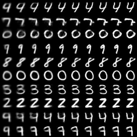
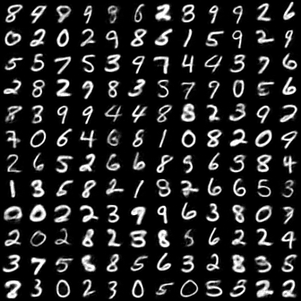
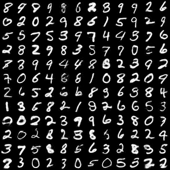

# VQ-DRAW

**VQ-DRAW** is a discrete [auto-encoder](https://en.wikipedia.org/wiki/Autoencoder) which encodes inputs in a sequential way similar to the [DRAW](https://arxiv.org/abs/1502.04623) architecture. Unlike [VQ-VAE](https://arxiv.org/abs/1711.00937), VQ-DRAW can generate good samples without learning an autoregressive prior on top of the dicrete latents.

In addition to the code for training, I've provided notebooks to play around with some small pre-trained models. These are intended to be runnable on a desktop PC, even without any GPU. Here is a list:

 * [mnist_demo.ipynb](mnist_demo.ipynb) - generate samples and intermediate refinements from an MNIST model
 * [svhn_demo.ipynb](svhn_demo.ipynb) - like mnist_demo.ipynb, but for SVHN.
 * [mnist_classify.ipynb](mnist_classify.ipynb) - train an MNIST classifier on top of features from a pre-trained MNIST encoder.

# Running experiments

```
python -u train_mnist.py --batch 32 --step-limit 50000 --save-interval 500
python -u train_svhn.py --batch 32 --step-interval 16 --step-limit 70000 --save-interval 500
python -u train_cifar.py --batch 32 --step-interval 16 --step-limit 34811 --save-interval 500 --grad-checkpoint
```

# How it works

The VQ-DRAW model reconstructs an image in stages, adding more details at every stage. Each stage adds a few extra bits of information to the latent code, allowing VQ-DRAW to make very good use of the latent information. Here is an example of 10 different MNIST digits being decoded stage by stage. In this example, each stage adds 6 bits:



Most of these images look pretty much complete after 5 stages (30 bits). Let's see how well 5 stages compare to 10 on a much larger set of samples:

Samples with 5 stages                |  Samples with 10 stages
:-----------------------------------:|:------------------------------------:
  |  
